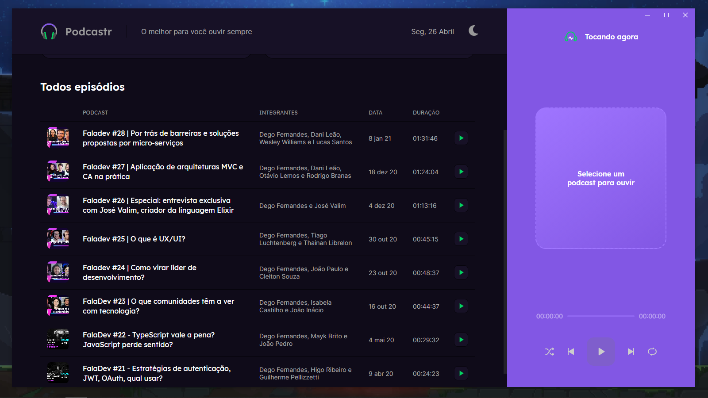

<br />
<p align="center"></p>
<hr />

<p align="center"></p>

<hr />

## Usage

### Get the project

```
$ git clone https://github.com/AndersonSantos0/electron-podcastr.git
```

### Install Dependencies

```
# using yarn
$ yarn

# using npm
$ npm install
```

### Use it

```
# development mode
$ yarn dev or npm run dev

# production build
$ yarn build or npm run build
```
